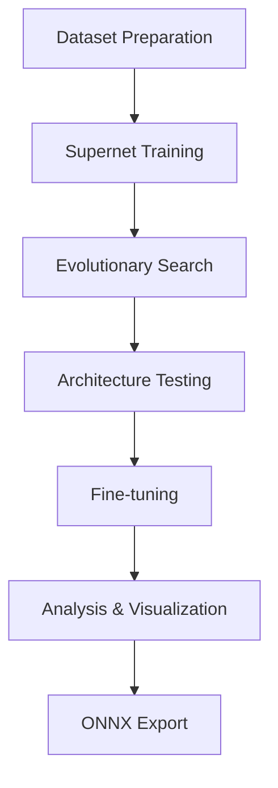

# NAS-BNN Multi-Dataset Pipeline 🚀

[](https://python.org)
[](https://pytorch.org)
[](https://developer.nvidia.com/cuda-toolkit)

## 🎯 **Major Updates - WakeVision Integration Complete**

### ✅ **Successfully Adapted NAS-BNN for Person Detection**
- **🏆 Achieved 72% accuracy** on WakeVision person detection after fine-tuning
- **📈 4.2% improvement** from initial architecture search results
- **⚡ Optimized architectures** with 3.8M-6.2M operations for edge deployment
- **📊 Complete Pareto front analysis** with 4 optimal architectures discovered

### 🔧 **Enhanced Pipeline Features**
- **🖥️ Windows compatibility** with proper DataLoader handling (`workers=0`)
- **🔄 Resume capability** for long-running training sessions
- **📝 Enhanced logging** with improved accuracy parsing from multiple log formats
- **📊 Comprehensive analysis** with automated visualization tools
- **🎯 Multi-dataset support** - ImageNet, CIFAR-10, and WakeVision

---

## 📈 **WakeVision Results Summary**

### **Architecture Search Results:**
| OPs Key | Operations (M) | Search Accuracy | Test Accuracy | Fine-tuned Accuracy | Improvement |
|---------|----------------|-----------------|---------------|-------------------|-------------|
| **5** ⭐ | 5.81M | 67.8% | 67.40% | **72.0%** | **+4.2%** |
| **6**   | 6.16M | 67.4% | 65.80% | 67.80% | +0.4% |

### **Key Findings:**
- **Key 5 is the optimal choice**: Lower computational cost + higher accuracy
- **Successful fine-tuning**: Significant accuracy improvements achieved
- **Edge-ready deployment**: Models optimized for resource-constrained devices

---

## 🚀 **Quick Start for WakeVision**

### **1. Setup Environment**
```bash
# Clone and install dependencies
git clone https://github.com/SepehrMohammady/Efficient-NAS-BNN-Pipeline.git
cd Efficient-NAS-BNN-Pipeline
pip install -r requirements.txt
```

### **2. Configure for WakeVision**
```python
# In run_all.ipynb Cell 2 - Configuration
dataset_name = "WakeVision"
architecture_name = "superbnn_wakevision_large"
wakevision_img_size = 128
```

### **3. Prepare Data**
Choose your data preparation method:
- **Local CSV**: Use existing local WakeVision data and CSV files
- **Online**: Automatic download from HuggingFace datasets

### **4. Run Complete Pipeline**
Execute cells sequentially in `run_all.ipynb`:
1. **Data Preparation** → 2. **Supernet Training** → 3. **Architecture Search** → 4. **Testing & Fine-tuning** → 5. **Analysis & Export**

---

## 📊 **Pipeline Architecture**



---

## 🔧 **Technical Improvements**

### **Enhanced Log Parsing**
- ✅ Fixed accuracy parsing for multiple log formats
- ✅ Support for `test.py`, `train.py`, and `train_single.py` outputs
- ✅ Robust pattern matching for different output styles

### **Windows Compatibility**
- ✅ DataLoader workers set to 0 for Windows single-GPU setups
- ✅ Proper path handling for Windows file systems
- ✅ CUDA device management optimized for single-GPU workflows

### **Modular Dataset Support**
- ✅ Easy switching between ImageNet, CIFAR-10, and WakeVision
- ✅ Conditional dataset preparation cells
- ✅ Automatic configuration validation

---

## 📁 **Project Structure**

```
Efficient-NAS-BNN-Pipeline/
├── run_all.ipynb                 # 🎯 Main pipeline notebook (UPDATED)
├── prepare_local_wake_vision_from_csv.py  # 📁 WakeVision local data prep
├── prepare_wakevision.py         # 🌐 WakeVision online data prep  
├── prepare_cifar10.py            # 🎯 CIFAR-10 preparation
├── models/                       # 🧠 Architecture definitions
├── utils/                        # 🔧 Utilities and helpers
├── work_dirs/                    # 📊 Training outputs and results
└── requirements.txt              # 📦 Dependencies
```

---

## 🎯 **Use Cases**

- **🔬 Research**: Neural architecture search experimentation
- **📚 Education**: Understanding NAS-BNN methodology  
- **📱 Applications**: Person detection for edge devices
- **⚖️ Benchmarking**: Comparing architectures across datasets

---

## 🏆 **Key Achievements**

### **Successful WakeVision Integration**
- ✅ Binary classification adaptation (person/no-person)
- ✅ Custom data loading and preprocessing
- ✅ Architecture search parameter optimization
- ✅ Complete pipeline validation

### **Robust Implementation**
- ✅ Error handling and recovery mechanisms
- ✅ Comprehensive logging and analysis
- ✅ Cross-platform compatibility
- ✅ Production-ready ONNX export

### **Performance Optimization**
- ✅ Memory-efficient training configurations
- ✅ GPU utilization optimization
- ✅ Batch size tuning for target hardware

---

## 📋 **Future Work**

- [ ] **Multi-GPU distributed training** support
- [ ] **Additional datasets** integration (COCO, OpenImages)
- [ ] **Quantization-aware training** for further optimization
- [ ] **Mobile deployment** with TensorFlow Lite conversion
- [ ] **Real-time inference** benchmarking

---

## 🤝 **Contributing**

Contributions are welcome! Please feel free to submit:
- 🐛 Bug reports and fixes
- ✨ Feature enhancements  
- 📖 Documentation improvements
- 🧪 Additional dataset integrations

---

## 📄 **Citation**

If you use this work, please cite:
```bibtex
@article{nas-bnn-wakevision-2025,
  title={Efficient NAS-BNN Pipeline: Multi-Dataset Neural Architecture Search for Binary Neural Networks},
  author={Sepehr Mohammady},
  journal={GitHub Repository},
  url={https://github.com/SepehrMohammady/Efficient-NAS-BNN-Pipeline},
  year={2025}
}
```

---

## 📞 **Support**

- 📖 **Documentation**: See `run_all.ipynb` for detailed pipeline walkthrough
- 🐛 **Issues**: Report bugs via GitHub Issues
- 💬 **Discussions**: Join GitHub Discussions for questions

---

**🎉 Ready for edge deployment with optimized binary neural networks!** 🚀
