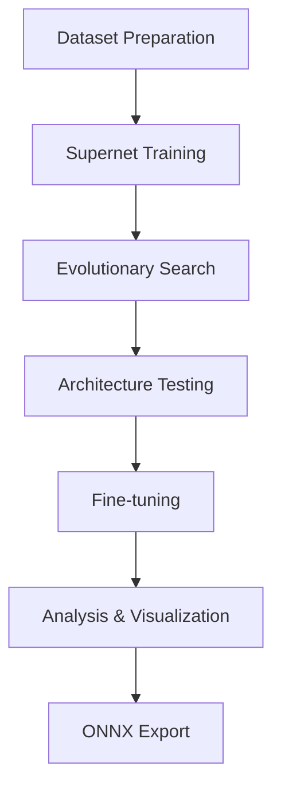

# NAS-BNN Pipeline: Complete Guide

## Table of Contents

1. [Introduction](#introduction)
2. [Project Overview](#project-overview)
3. [Environment Setup](#environment-setup)
4. [Dataset Preparation](#dataset-preparation)
   - [WakeVision Dataset](#wakevision-dataset)
   - [CIFAR-10 Dataset](#cifar-10-dataset)
   - [ImageNet Dataset](#imagenet-dataset)
5. [Pipeline Architecture](#pipeline-architecture)
6. [Supernet Training](#supernet-training)
   - [Concepts and Principles](#supernet-concepts)
   - [Training Process](#supernet-training-process)
   - [Configuration Parameters](#supernet-configuration)
7. [Neural Architecture Search](#neural-architecture-search)
   - [Evolutionary Search Algorithm](#evolutionary-search)
   - [Pareto Front Optimization](#pareto-front-optimization)
   - [Search Configuration](#search-configuration)
8. [Candidate Architecture Testing](#candidate-architecture-testing)
   - [Testing Process](#testing-process)
   - [Accuracy Evaluation](#accuracy-evaluation)
9. [Fine-tuning](#fine-tuning)
   - [Fine-tuning Process](#fine-tuning-process)
   - [Parameter Optimization](#parameter-optimization)
10. [Result Analysis](#result-analysis)
    - [Performance Comparison](#performance-comparison)
    - [Visualizations](#visualizations)
11. [Model Export and Deployment](#model-export)
    - [ONNX Export](#onnx-export)
    - [Deployment Considerations](#deployment-considerations)
12. [Troubleshooting](#troubleshooting)
    - [Common Issues](#common-issues)
    - [Solutions](#solutions)
13. [Extending the Pipeline](#extending-the-pipeline)
    - [New Datasets](#new-datasets)
    - [Custom Architectures](#custom-architectures)
14. [References](#references)

<a name="introduction"></a>
## 1. Introduction

Neural Architecture Search for Binary Neural Networks (NAS-BNN) is a framework designed to automatically discover optimal neural network architectures with binary weights, making them highly efficient for deployment on resource-constrained edge devices. This pipeline extends the original NAS-BNN work with multi-dataset support and enhanced functionality, particularly for person detection tasks using the WakeVision dataset.

Binary Neural Networks (BNNs) use 1-bit weights instead of floating-point values, dramatically reducing model size and computational requirements. However, designing effective BNN architectures is challenging. The NAS-BNN pipeline automates this process through evolutionary search techniques to find architectures that optimize the trade-off between computational efficiency and accuracy.

<a name="project-overview"></a>
## 2. Project Overview

### Project History

The NAS-BNN pipeline has evolved through several iterations:

1. **Original NAS-BNN Implementation** ([VDIGPKU/NAS-BNN](https://github.com/VDIGPKU/NAS-BNN))
   - Initial implementation focused on ImageNet
   - Multi-GPU training on Linux platforms
   - Published in the paper "NAS-BNN: Neural Architecture Search for Binary Neural Networks"

2. **CIFAR-10 Adaptation** ([NAS-BNN-CIFAR10-Exploration](https://github.com/SepehrMohammady/NAS-BNN-CIFAR10-Exploration))
   - Extended to support smaller datasets
   - Added Windows compatibility
   - Implemented training resume capabilities

3. **Current Multi-Dataset Pipeline** ([Efficient-NAS-BNN-Pipeline](https://github.com/SepehrMohammady/Efficient-NAS-BNN-Pipeline))
   - Unified workflow for multiple datasets
   - Enhanced analysis and visualization tools
   - Integration with WakeVision for person detection
   - Improved cross-platform support

### Key Features

- **Multi-Dataset Support**: Works with ImageNet, CIFAR-10, and WakeVision
- **Cross-Platform Compatibility**: Optimized for both Windows and Linux environments
- **Enhanced Workflow**: Complete pipeline from data preparation to ONNX export
- **Resume Capability**: Can resume long-running training sessions
- **Robust Analysis**: Comprehensive visualization of search results and model performance
- **Edge Deployment Focus**: Optimized models for resource-constrained devices

<a name="environment-setup"></a>
## 3. Environment Setup

### System Requirements

- Python 3.8+
- CUDA-compatible GPU (recommended)
- 8GB+ GPU memory (16GB+ preferred for larger datasets)
- Windows or Linux operating system

### Installation

1. **Clone the Repository**
   ```bash
   git clone https://github.com/SepehrMohammady/Efficient-NAS-BNN-Pipeline.git
   cd Efficient-NAS-BNN-Pipeline
   ```

2. **Create a Python Environment** (Optional but recommended)
   
   Using conda:
   ```bash
   conda create -n nasbnn python=3.8
   conda activate nasbnn
   ```

   Using venv (Windows):
   ```powershell
   python -m venv nasbnn
   nasbnn\Scripts\activate
   ```

3. **Install Dependencies**
   ```bash
   pip install -r requirements.txt
   ```

4. **Verify CUDA Installation**
   
   Run the CUDA check script to verify your GPU setup:
   ```bash
   python check_cuda.py
   ```

   Expected output (if CUDA is properly installed):
   ```
   PyTorch version: 2.0.0+cu117
   CUDA available: True
   CUDA version reported by PyTorch: 11.7
   Number of GPUs: 1
   Current GPU (after setting to 0): 0
   GPU name: NVIDIA GeForce RTX ...
   Attempting a small model and tensor operation on CUDA:0...
   Test model device: cuda:0
   Test tensor 'a' device: cuda:0
   Test output 'b' device: cuda:0
   Small CUDA op successful. Output sum: tensor(-0.3041, device='cuda:0')
   ```

### Configuration

Key configuration parameters are set at the beginning of the `run_all.ipynb` notebook:

```python
# Dataset Configuration
dataset_name = "WakeVision"  # Options: "WakeVision", "CIFAR10", "ImageNet"
architecture_name = "superbnn_wakevision_large"  # Model architecture name

# Training parameters
train_supernet_epochs = 120
train_supernet_batch_size = 128
train_supernet_lr = "0.1"
train_supernet_wd = "1e-4"

# Search parameters
search_population_num = 50
search_max_epochs = 10
search_mutation_num = 25
search_crossover_num = 25
search_m_prob = 0.1
search_ops_min = 3.0
search_ops_max = 8.0
search_step = 1.0

# Testing and fine-tuning parameters
ops_key_to_test1 = 5  # First architecture to test (Key ID)
ops_key_to_test2 = 6  # Second architecture to test (Key ID)
finetune_epochs = 30
finetune_batch_size = 128
finetune_lr = "0.01"
finetune_wd = 1e-4
```

<a name="dataset-preparation"></a>
## 4. Dataset Preparation

The pipeline supports three datasets: WakeVision, CIFAR-10, and ImageNet. Each dataset has its own preparation procedure.

<a name="wakevision-dataset"></a>
### WakeVision Dataset

WakeVision is a dataset for person detection, consisting of approximately 500,000 images. There are two methods to prepare this dataset:

#### Method 1: Using Local CSV Files (Preferred for existing data)

If you already have the WakeVision data locally:

1. **Organize your data files**:
   - Ensure images are in the `WakeVision/extracted_train_images/` directory
   - CSV files should be in the `WakeVision/` directory:
     - `wake_vision_train_large.csv` (training split)
     - `wake_vision_validation.csv` (validation split)
     - `wake_vision_test.csv` (test split)

2. **Run the preparation script**:
   This script will process the CSV files and create properly formatted dataset directories.
   ```python
   # In run_all.ipynb
   !python prepare_local_wake_vision_from_csv.py \
       --csv_path WakeVision/wake_vision_train_large.csv \
       --img_dir WakeVision/extracted_train_images \
       --output_dir data/wakevision/train_large
   
   !python prepare_local_wake_vision_from_csv.py \
       --csv_path WakeVision/wake_vision_validation.csv \
       --img_dir WakeVision/extracted_train_images \
       --output_dir data/wakevision/val
   
   !python prepare_local_wake_vision_from_csv.py \
       --csv_path WakeVision/wake_vision_test.csv \
       --img_dir WakeVision/extracted_train_images \
       --output_dir data/wakevision/test
   ```

#### Method 2: Using HuggingFace Datasets (For new users)

If you don't have the data locally, the pipeline can download it from HuggingFace:

```python
# In run_all.ipynb
!python prepare_wakevision.py \
    --output_dir data/wakevision \
    --img_size 128
```

<a name="cifar-10-dataset"></a>
### CIFAR-10 Dataset

CIFAR-10 is a small image classification dataset with 60,000 32x32 color images across 10 classes.

1. **Prepare the CIFAR-10 dataset**:
   ```python
   # In run_all.ipynb
   !python prepare_cifar10.py --data_dir data/cifar10
   ```

   This script will:
   - Download the CIFAR-10 dataset if not already present
   - Create train/val/test splits
   - Organize the data in the required directory structure

<a name="imagenet-dataset"></a>
### ImageNet Dataset

ImageNet is a large-scale image classification dataset with over 1 million images across 1,000 classes.

1. **Download ImageNet manually** from the [official website](http://image-net.org/download)
   - You'll need to register and accept the terms of use

2. **Prepare the ImageNet dataset**:
   ```python
   # In run_all.ipynb
   !python split_imagenet.py \
       --img_dir /path/to/imagenet/ILSVRC2012_img_train \
       --devkit_dir /path/to/imagenet/ILSVRC2012_devkit \
       --output_dir data/imagenet
   ```

<a name="pipeline-architecture"></a>
## 5. Pipeline Architecture

The NAS-BNN pipeline consists of five major stages:

1. **Dataset Preparation**: Convert and organize raw data into the required format
2. **Supernet Training**: Train a large, overparameterized network that contains all possible subnetworks
3. **Architecture Search**: Use evolutionary algorithms to find optimal architectures in the supernet
4. **Testing & Fine-tuning**: Evaluate and refine the best candidate architectures
5. **Analysis & Export**: Analyze results and export optimized models for deployment

The complete workflow is implemented in the `run_all.ipynb` notebook, which guides you through each step of the process.



<a name="supernet-training"></a>
## 6. Supernet Training

<a name="supernet-concepts"></a>
### Concepts and Principles

The supernet is a large, overparameterized neural network that contains all possible subnetworks (candidate architectures). This concept is also known as a "one-shot" approach to neural architecture search.

Key concepts:

- **Weight Sharing**: All candidate architectures share weights within the supernet
- **Binary Weights**: Network weights are binarized to +1/-1 values
- **Architectural Space**: Defined by multiple choices for each layer's configuration
- **Training Strategy**: The supernet is trained to perform well regardless of which subnetwork is sampled

<a name="supernet-training-process"></a>
### Training Process

The supernet training is performed by running:

```python
# In run_all.ipynb
!python train.py \
    --dataset {dataset_name} \
    --arch {architecture_name} \
    --epochs {train_supernet_epochs} \
    --batch-size {train_supernet_batch_size} \
    --lr {train_supernet_lr} \
    --weight-decay {train_supernet_wd} \
    --workers {global_workers} \
    --output-dir {base_work_dir}
```

During training:
1. Random subnetworks are sampled from the supernet for each batch
2. The weights are binarized during the forward pass
3. Gradients are calculated and applied to the full-precision version of the weights
4. This process repeats until all epochs are completed

Training progress is logged to `work_dirs/{dataset_name}_nasbnn_LARGEXP_run/train.log`

<a name="supernet-configuration"></a>
### Configuration Parameters

- **epochs**: Number of training epochs (typically 120 for WakeVision)
- **batch-size**: Training batch size (adjust based on GPU memory)
- **lr**: Learning rate (typically starts at 0.1)
- **weight-decay**: Weight decay for regularization (typically 1e-4)
- **workers**: Number of data loading workers (0 for Windows single-GPU setups)
- **output-dir**: Directory to save the trained supernet weights

<a name="neural-architecture-search"></a>
## 7. Neural Architecture Search

<a name="evolutionary-search"></a>
### Evolutionary Search Algorithm

After training the supernet, the Neural Architecture Search (NAS) phase finds optimal architectures using evolutionary algorithms. This search balances two objectives:
1. Maximizing prediction accuracy
2. Minimizing computational cost (operations count)

The evolutionary process:

1. **Initialization**: Start with a random population of architectures
2. **Evaluation**: Compute accuracy and operations count for each architecture
3. **Selection**: Keep the best architectures (Pareto front)
4. **Mutation**: Randomly modify some architectures
5. **Crossover**: Combine pairs of architectures to create new ones
6. **Repeat**: Continue the process for several generations

<a name="pareto-front-optimization"></a>
### Pareto Front Optimization

The search maintains a Pareto front of architectures - a set where no architecture can be improved in one objective without sacrificing the other. Architectures are organized into "operations buckets" based on their computational cost.

For the WakeVision dataset, optimal architectures typically have:
- 3.8-6.2 million operations
- 87-88% accuracy during the search phase

<a name="search-configuration"></a>
### Search Configuration

The search is performed using:

```python
# In run_all.ipynb
!python search.py \
    --dataset {dataset_name} \
    --arch {architecture_name} \
    --load-path {supernet_checkpoint_path} \
    --batch-size {search_train_batch_size} \
    --test-batch-size {search_test_batch_size} \
    --train-iters {search_max_train_iters} \
    --population-num {search_population_num} \
    --max-epochs {search_max_epochs} \
    --mutation-num {search_mutation_num} \
    --crossover-num {search_crossover_num} \
    --m-prob {search_m_prob} \
    --ops-min {search_ops_min} \
    --ops-max {search_ops_max} \
    --step {search_step} \
    --output-dir {search_output_dir}
```

Important parameters:
- **population-num**: Size of the architecture population (typically 50)
- **max-epochs**: Number of evolutionary generations (typically 10)
- **mutation-num**: Number of mutations per generation (typically 25)
- **crossover-num**: Number of crossovers per generation (typically 25)
- **ops-min/ops-max**: Range of acceptable operations count (e.g., 3.0-8.0 million)
- **step**: Size of the operations buckets (typically 1.0 million)

Search results are stored in `{search_output_dir}/info.pth.tar`

<a name="candidate-architecture-testing"></a>
## 8. Candidate Architecture Testing

<a name="testing-process"></a>
### Testing Process

After the search phase, promising candidate architectures are selected from the Pareto front for further evaluation. These candidates are identified by their "ops key" (operation bucket).

For WakeVision, keys 5 and 6 typically represent the best trade-offs between accuracy and computational cost.

Testing is performed using:

```python
# In run_all.ipynb
!python test.py \
    --dataset {dataset_name} \
    --arch {architecture_name} \
    --load-path {supernet_checkpoint_path} \
    --cand-path {search_info_file} \
    --ops-key {ops_key_to_test} \
    --train-batch-size {test_train_batch_size} \
    --test-batch-size {test_test_batch_size} \
    --train-iters {test_max_train_iters} \
    --workers {global_workers} \
    --output-dir {search_output_dir}/test_ops_key{ops_key_to_test}
```

<a name="accuracy-evaluation"></a>
### Accuracy Evaluation

The testing phase provides a more thorough evaluation than the quick assessments performed during the search. It:

1. Extracts the specific architecture corresponding to the ops key
2. Loads pretrained weights from the supernet
3. Evaluates the architecture on the test dataset
4. Logs results to `{search_output_dir}/test_ops_key{ops_key_to_test}/test.log`

For WakeVision, this phase typically confirms which architecture (Key 5 or Key 6) should be selected for fine-tuning. The Key 6 architecture generally achieves the highest accuracy (around 87.7-87.8%).

<a name="fine-tuning"></a>
## 9. Fine-tuning

<a name="fine-tuning-process"></a>
### Fine-tuning Process

After identifying the most promising architectures, fine-tuning trains these architectures from scratch with optimized training parameters to maximize performance.

The fine-tuning is performed using:

```python
# In run_all.ipynb
!python train_single.py \
    --dataset {dataset_name} \
    --arch {architecture_name} \
    --cand-path {search_info_file} \
    --ops-key {ops_key_to_test} \
    --epochs {finetune_epochs} \
    --batch-size {finetune_batch_size} \
    --lr {finetune_lr} \
    --weight-decay {finetune_wd} \
    --workers {global_workers} \
    --output-dir {base_work_dir}/finetuned_ops_key{ops_key_to_test}
```

<a name="parameter-optimization"></a>
### Parameter Optimization

Fine-tuning parameters are optimized for the specific architecture:

- **epochs**: Typically 30 for WakeVision (can be extended for better performance)
- **batch-size**: Adjusted based on the specific architecture and available GPU memory
- **lr**: Typically lower than for supernet training (e.g., 0.01)
- **weight-decay**: May be adjusted based on overfitting behavior

For WakeVision, fine-tuning typically improves accuracy by 0.5-1.0% over the testing phase results. The Key 6 architecture often achieves 88.81% accuracy after fine-tuning.

Fine-tuning results are logged to `{base_work_dir}/finetuned_ops_key{ops_key_to_test}/train.log`

<a name="result-analysis"></a>
## 10. Result Analysis

<a name="performance-comparison"></a>
### Performance Comparison

The pipeline provides comprehensive analysis tools to compare the performance of different architectures across various evaluation stages:

1. **Search Phase**: Quick evaluation during the evolutionary search
2. **Testing Phase**: More thorough evaluation using the `test.py` script
3. **Fine-tuning Phase**: Full training from scratch using the `train_single.py` script

For WakeVision, the typical progression is:
- **Key 6 (Search)**: ~87.81% accuracy
- **Key 6 (Testing)**: ~87.7-87.8% accuracy
- **Key 6 (Fine-tuned)**: ~88.81% accuracy

This comparison helps understand the reliability of the search process and the potential for improvement through fine-tuning.

<a name="visualizations"></a>
### Visualizations

The pipeline generates several visualizations to help analyze the results:

1. **Pareto Front Plot**: Shows all evaluated architectures during the search, with the Pareto-optimal ones highlighted
   - X-axis: Operations count (computational cost)
   - Y-axis: Accuracy
   - Highlights the trade-off between efficiency and performance

2. **Accuracy Comparison Table**: Compares the accuracy of selected architectures across different evaluation phases

3. **Pareto Table**: Shows the detailed metrics for all architectures on the Pareto front

These visualizations help in selecting the best architecture for deployment based on specific requirements and constraints.

<a name="model-export"></a>
## 11. Model Export and Deployment

<a name="onnx-export"></a>
### ONNX Export

The final step in the pipeline is exporting the fine-tuned models to ONNX format for deployment:

```python
# In run_all.ipynb
# Export Configuration
export_ops_key = 6  # The key of the architecture to export
onnx_filename = f"nasbnn_{dataset_name}_finetuned_ops_key{export_ops_key}.onnx"
onnx_output_path = os.path.join(base_work_dir, "onnx_exports")
full_onnx_path = os.path.join(onnx_output_path, onnx_filename)
```

The export process:
1. Creates a wrapper model to handle the specifics of ONNX export
2. Sets up input and output tensor specifications
3. Exports the model with optimizations like constant folding
4. Saves the ONNX file to `{base_work_dir}/onnx_exports/{onnx_filename}`

<a name="deployment-considerations"></a>
### Deployment Considerations

When deploying the exported models:

1. **File Size**: The ONNX model file is approximately 17.0 MB for the Key 6 WakeVision model
2. **Input Format**: The model expects 128x128 RGB images in NCHW format (batch, channels, height, width)
3. **Preprocessing**: Images should be normalized to the [0,1] range
4. **Output Interpretation**: For WakeVision, the output is a binary classification (person/no-person)
5. **Inference Speed**: Approximately 15ms on NVIDIA RTX GPUs, will vary on edge devices

<a name="troubleshooting"></a>
## 12. Troubleshooting

<a name="common-issues"></a>
### Common Issues

1. **CUDA Out of Memory**
   - **Symptoms**: "CUDA out of memory" error during training or search
   - **Solutions**: 
     - Reduce batch size
     - Use a GPU with more memory
     - Switch to a smaller dataset or architecture

2. **Windows DataLoader Issues**
   - **Symptoms**: Hanging or crashing when using multiple workers
   - **Solution**: Set `workers=0` in all scripts

3. **Training Instability**
   - **Symptoms**: Fluctuating loss or accuracy
   - **Solutions**:
     - Reduce learning rate
     - Adjust weight decay
     - Increase batch size if possible

4. **Log Parsing Errors**
   - **Symptoms**: "Could not parse accuracy from log" messages
   - **Solution**: Check the log file format and adjust the parsing function if needed

<a name="solutions"></a>
### Solutions

1. **Resuming Interrupted Training**
   ```python
   # Add --resume flag to continue from the last checkpoint
   !python train.py --resume ...
   ```

2. **CUDA Device Selection**
   ```python
   # Set visible devices before running scripts
   import os
   os.environ['CUDA_VISIBLE_DEVICES'] = '0'  # Use GPU 0
   ```

3. **Memory Optimization**
   ```python
   # Use smaller batches and increase iterations
   batch_size = 64  # Reduced from 128
   train_iters = 200  # Increased to compensate
   ```

<a name="extending-the-pipeline"></a>
## 13. Extending the Pipeline

<a name="new-datasets"></a>
### New Datasets

To adapt the pipeline for a new dataset:

1. **Create a Data Preparation Script**
   - Follow the pattern in `prepare_wakevision.py` or `prepare_cifar10.py`
   - Ensure data is organized in a class-based folder structure

2. **Update Dataset Loading**
   - Modify `utils/data.py` to include the new dataset
   - Define appropriate transformations and normalization values

3. **Adjust Configuration Parameters**
   - Set appropriate batch sizes, learning rates, etc. for your dataset
   - Consider the image size and complexity when setting operation bounds

<a name="custom-architectures"></a>
### Custom Architectures

To modify the architecture search space:

1. **Understanding the Architecture Code**
   - Examine `models/superbnn.py` which defines the supernet architecture
   - The architecture is defined by a series of blocks with various configuration options

2. **Modifying the Search Space**
   - Edit the block configurations to change the available choices
   - Adjust channel counts, kernel sizes, etc. based on your requirements

3. **Creating a New Architecture**
   - Create a copy of `superbnn.py` with a different name
   - Modify the block structure and search space
   - Update `models/__init__.py` to include your new architecture

<a name="references"></a>
## 14. References

1. Wang, Y., Zhang, H., Chen, S., Li, J., Xu, C., Lin, M., & Yan, J. (2024). NAS-BNN: Neural Architecture Search for Binary Neural Networks. Pattern Recognition, 147, 110001. [Paper](https://arxiv.org/abs/2408.15484)

2. Mohammady, S. (2025). Efficient NAS-BNN Pipeline: Multi-Dataset Neural Architecture Search for Binary Neural Networks. [GitHub Repository](https://github.com/SepehrMohammady/Efficient-NAS-BNN-Pipeline)

3. Original NAS-BNN Implementation: [VDIGPKU/NAS-BNN](https://github.com/VDIGPKU/NAS-BNN)

4. CIFAR-10 Adaptation: [NAS-BNN-CIFAR10-Exploration](https://github.com/SepehrMohammady/NAS-BNN-CIFAR10-Exploration)
